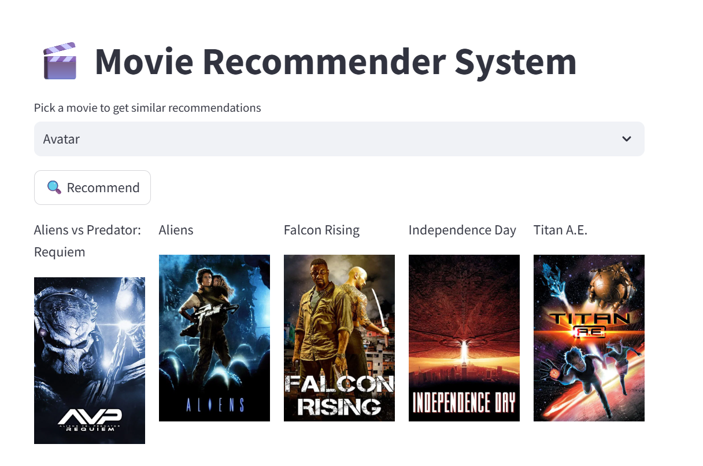

# 🎬 Movie Recommendation System with Streamlit

Welcome to an AI-powered movie suggestion app that recommends films based on your favorites using **cosine similarity** and **movie embeddings**. Built with ❤️ using **Python**, **Streamlit**, and **Scikit-learn**, this interactive project blends machine learning and web development into a smart and fun tool.

<p align="center">
  
</p>


---

## 🚀 Demo

🔥 **Try it live on Streamlit Cloud or Heroku** (Coming Soon)  
🧪 Type a movie like `Inception` or `Avengers` to get intelligent recommendations.

---

## 🧠 How It Works

> Behind the scenes, the app uses vectorized movie plots and **cosine similarity** to find titles that are semantically closest to the input.

- Loads preprocessed `.pkl` files containing:
  - A movie dataset
  - A similarity matrix
- Captures user input
- Outputs top 5 similar movies instantly

---

## 🧰 Tech Stack

| Technology   | Purpose                         |
|-------------|----------------------------------|
| Python       | Core programming                |
| Streamlit    | Lightweight web UI              |
| Pandas       | Data handling                   |
| Scikit-learn | Cosine similarity calculation   |
| Pickle       | Model & data serialization      |

---

## ✨ Example Output

Input: `Inception`  
Top recommendations:

• Interstellar
• The Matrix
• Shutter Island
• Tenet
• Memento


---

## 📦 Setup & Installation

```bash
# 1. Clone the repository
git clone https://github.com/ramyache10/MovieSuggestion.git
cd MovieSuggestion

# 2. Install dependencies
pip install -r requirements.txt

# 3. Run the app
streamlit run app.py
⚠️ Make sure to manually place .pkl files (like similarity.pkl) in the project root if not included due to GitHub's file size limit.

🌐 Deployment Ready
Deploy on:

Heroku

Streamlit Cloud

Render

Only requires pushing your repo and uploading .pkl files manually.

🧑‍💻 Author
Ramyasri Chapala
🔗 LinkedIn
📫 Email


